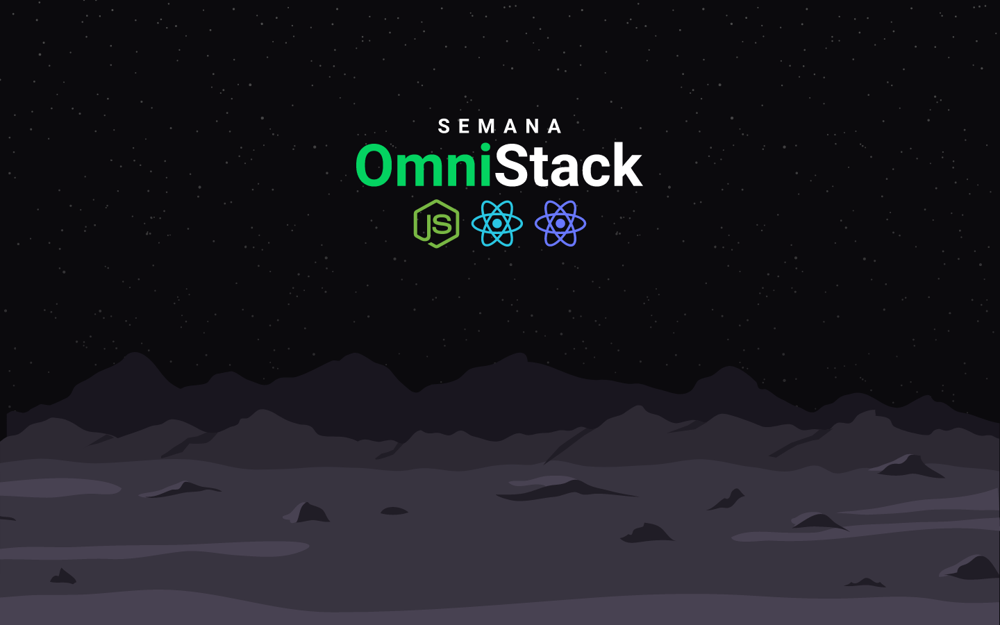

# OmniStack Week 8

OmniStack Week is an online event maked available Rocketseat (https://rocketseat.com.br/week-8/) with aim to show the power of the stack React, React Native and Nodejs. During the version 8 of the event an application based on Tinder was developed, containing a web site, an mobile application and REST API.

## Repository structure

- frontend folder - The website implemented with ReactJS
- mobile folder - The mobile application implemented with React Native
- backend folder - The REST API implemented with NodeJS

## Implemented funcionalities

- Authentication with github username
- Like and Dislike
- Realtime MATCH when two users like each other
